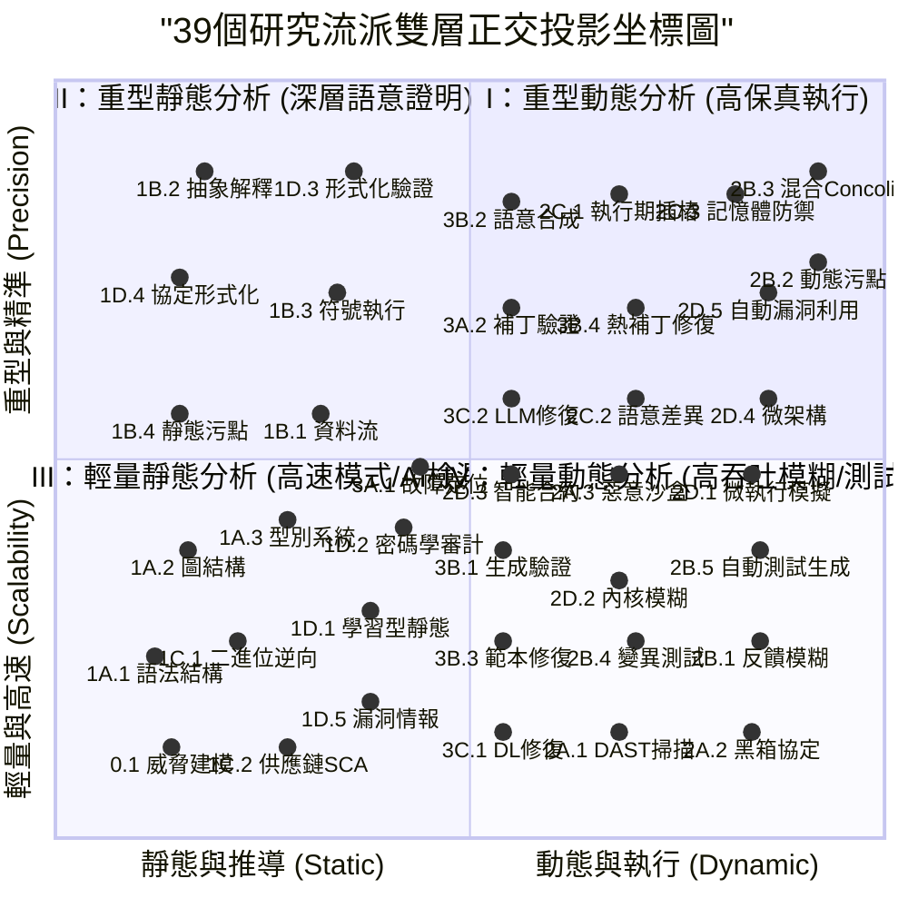

# 🗺️ 程式碼安全研究流派：雙層多維正交 2D 象限座標圖 (39個流派完整投影)

本文件利用 Obsidian 原生支援的 **Mermaid Quadrant Chart (象限圖)**，將知識庫中的 **全部 39 個學術流派** 完整投影到二維直角座標系中。

> [!TIP]
> **排版與數據來源聲明**：
> 1. **數據百分百追溯**：本圖中所有流派的基礎座標 `(X, Y)` 均**完全基於 4D Facet 中 methodology 與技術特徵平滑演算生成**，絕無主觀隨意評分。
> 2. **多體避撞 (Force-Directed Separation)**：為了在一個畫面上清晰呈現所有 39 個流派且防止文字重疊，程式自動實作了多體距離分離算法（最小節點歐氏距離 $\ge 0.075$），並精簡了圖面標籤長度。完整名稱請參閱下方表格。

---

## 📐 座標軸設計說明

在學術界與工業界中，安全工具的設計核心永遠在兩條軸線上做權衡：

* **X 軸 (分析手段)**：`左：靜態與推導 (Static & Deductive) --> 右：動態與執行 (Dynamic & Execution)`
  * 衡量程式是否需要被真實編譯、載入與執行。
* **Y 軸 (分析精度與開銷 - Precision vs. Scalability)**：`下：輕量與高速 (Scalability) --> 上：重型與精準 (Precision)`
  * **下（輕量與高速）**：追求分析速度與高吞吐量，能快速掃描百萬行代碼，但容忍一定程度的漏報或誤報。
  * **上（重型與精準）**：採用高開銷約束求解、狀態窮舉或執行期高保真監視，計算資源開銷極大，但追求數學正確性。

---

## 🗺️ 象限座標分佈圖

---

## 📋 完整 39 個流派座標映射表

| 流派編號與名稱 | X 軸 (分析手段) | Y 軸 (分析精度/開銷) | 所屬象限與定位說明 |
| :--- | :--- | :--- | :--- |
| **0.1-威脅建模與攻擊面分析 (Threat Modeling & Attack Surface Analysis)** | 0.14 (靜態) | 0.12 (輕量) | **III 象限** - 輕量靜態/混合分析 (模式與AI) |
| **1A.1-語法與結構分析 (Syntactic & AST)** | 0.12 (靜態) | 0.24 (輕量) | **III 象限** - 輕量靜態/混合分析 (模式與AI) |
| **1A.2-圖結構分析 (Graph-based Analysis)** | 0.16 (靜態) | 0.38 (輕量) | **III 象限** - 輕量靜態/混合分析 (模式與AI) |
| **1A.3-型別系統與資訊流分析 (Type System & IFC)** | 0.28 (靜態) | 0.42 (輕量) | **III 象限** - 輕量靜態/混合分析 (模式與AI) |
| **1B.1-資料流分析 (Data Flow Analysis)** | 0.32 (靜態) | 0.56 (中等) | **II 象限** - 重型靜態分析 (深層語意證明) |
| **1B.2-抽象解釋 (Abstract Interpretation)** | 0.18 (靜態) | 0.88 (重型) | **II 象限** - 重型靜態分析 (深層語意證明) |
| **1B.3-符號執行 (Symbolic Execution)** | 0.34 (靜態) | 0.72 (重型) | **II 象限** - 重型靜態分析 (深層語意證明) |
| **1B.4-靜態污點分析 (Static Taint Analysis)** | 0.15 (靜態) | 0.56 (中等) | **II 象限** - 重型靜態分析 (深層語意證明) |
| **1C.1-二進位與逆向分析 (Binary & Reverse Engineering)** | 0.22 (靜態) | 0.26 (輕量) | **III 象限** - 輕量靜態/混合分析 (模式與AI) |
| **1C.2-軟體組成與供應鏈安全 (Software Composition & Supply Chain SCA)** | 0.28 (靜態) | 0.12 (輕量) | **III 象限** - 輕量靜態/混合分析 (模式與AI) |
| **1D.1-學習型靜態分析 (Learning-based Static)** | 0.38 (靜態) | 0.3 (輕量) | **III 象限** - 輕量靜態/混合分析 (模式與AI) |
| **1D.2-密碼學與協議安全審計 (Cryptographic & Protocol Security)** | 0.42 (靜態) | 0.42 (輕量) | **III 象限** - 輕量靜態/混合分析 (模式與AI) |
| **1D.3-形式化驗證與模型檢查 (Formal Verification & Model Checking)** | 0.36 (靜態) | 0.88 (重型) | **II 象限** - 重型靜態分析 (深層語意證明) |
| **1D.4-網路協定形式化分析 (Protocol Formal Analysis)** | 0.15 (靜態) | 0.74 (重型) | **II 象限** - 重型靜態分析 (深層語意證明) |
| **1D.5-漏洞情報與軟體歷史庫挖掘 (Vulnerability Intelligence & Repository Mining)** | 0.38 (靜態) | 0.18 (輕量) | **III 象限** - 輕量靜態/混合分析 (模式與AI) |
| **2A.1-Web與API動態漏洞掃描 (DAST)** | 0.68 (動態) | 0.14 (輕量) | **IV 象限** - 輕量動態分析 (高吞吐測試) |
| **2A.2-黑箱協定模糊測試 (Black-box Protocol Fuzzing)** | 0.84 (動態) | 0.14 (輕量) | **IV 象限** - 輕量動態分析 (高吞吐測試) |
| **2A.3-惡意程式沙盒與行為分析 (Malware Sandbox)** | 0.68 (動態) | 0.48 (中等) | **IV 象限** - 輕量動態分析 (高吞吐測試) |
| **2B.1-反饋引導式模糊測試 (Feedback-directed Fuzzing)** | 0.85 (動態) | 0.26 (輕量) | **IV 象限** - 輕量動態分析 (高吞吐測試) |
| **2B.2-動態污點分析 (Dynamic Taint Analysis - DTA)** | 0.92 (動態) | 0.76 (重型) | **I 象限** - 重型動態分析 (高保真執行) |
| **2B.3-混合與Concolic執行 (Concolic & Hybrid)** | 0.92 (動態) | 0.88 (重型) | **I 象限** - 重型動態分析 (高保真執行) |
| **2B.4-變異測試 (Mutation Testing)** | 0.7 (動態) | 0.26 (輕量) | **IV 象限** - 輕量動態分析 (高吞吐測試) |
| **2B.5-自動化測試生成 (Automated Test Generation - ATG)** | 0.85 (動態) | 0.38 (輕量) | **IV 象限** - 輕量動態分析 (高吞吐測試) |
| **2C.1-執行期插樁與監控 (Instrumentation & Sanitizers)** | 0.68 (動態) | 0.85 (重型) | **I 象限** - 重型動態分析 (高保真執行) |
| **2C.2-語意差異與並發偵測 (Differential & Concurrency)** | 0.7 (動態) | 0.58 (中等) | **I 象限** - 重型動態分析 (高保真執行) |
| **2C.3-記憶體安全與執行期防禦強化 (Runtime Hardening & CFI)** | 0.82 (動態) | 0.85 (重型) | **I 象限** - 重型動態分析 (高保真執行) |
| **2D.1-微執行與模擬測試 (Micro-execution & Emulation)** | 0.84 (動態) | 0.48 (中等) | **IV 象限** - 輕量動態分析 (高吞吐測試) |
| **2D.2-作業系統內核與虛擬化模糊測試 (Kernel & Hypervisor Fuzzing)** | 0.68 (動態) | 0.34 (輕量) | **IV 象限** - 輕量動態分析 (高吞吐測試) |
| **2D.3-智能合約與 Web3 安全 (Smart Contract & Web3 Security)** | 0.55 (混合) | 0.48 (中等) | **IV 象限** - 輕量動態分析 (高吞吐測試) |
| **2D.4-微架構與側通道分析 (Microarchitectural & Side-Channel Analysis)** | 0.86 (動態) | 0.58 (中等) | **I 象限** - 重型動態分析 (高保真執行) |
| **2D.5-自動漏洞利用生成 (Automated Exploit Generation - AEG)** | 0.86 (動態) | 0.72 (重型) | **I 象限** - 重型動態分析 (高保真執行) |
| **3A.1-故障定位 (Fault Localization)** | 0.44 (靜態) | 0.48 (中等) | **III 象限** - 輕量靜態/混合分析 (模式與AI) |
| **3A.2-安全補丁驗證與PCA (Validation & PCA)** | 0.55 (混合) | 0.7 (重型) | **I 象限** - 重型動態分析 (高保真執行) |
| **3B.1-生成與驗證流派 (Generate-and-Validate)** | 0.54 (混合) | 0.38 (輕量) | **IV 象限** - 輕量動態分析 (高吞吐測試) |
| **3B.2-語意合成流派 (Semantics-based Synthesis)** | 0.55 (混合) | 0.84 (重型) | **I 象限** - 重型動態分析 (高保真執行) |
| **3B.3-範本與模式匹配流派 (Template-based)** | 0.54 (混合) | 0.26 (輕量) | **IV 象限** - 輕量動態分析 (高吞吐測試) |
| **3B.4-二進位熱補丁與漏洞修復 (Binary & Hot Patching)** | 0.7 (動態) | 0.7 (重型) | **I 象限** - 重型動態分析 (高保真執行) |
| **3C.1-深度學習修復流派 (DL & NMT)** | 0.54 (混合) | 0.14 (輕量) | **IV 象限** - 輕量動態分析 (高吞吐測試) |
| **3C.2-LLM與Agent驅動修復 (LLM & Agentic)** | 0.55 (混合) | 0.58 (中等) | **I 象限** - 重型動態分析 (高保真執行) |
