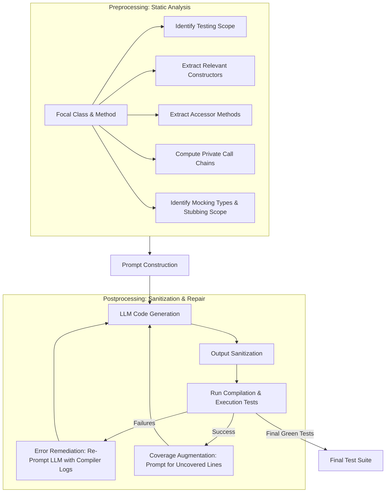

# 📖 ASTER: Natural and Multi-language Unit Test Generation with LLMs

## 📄 本地 PDF 連結
- [[ASTER_Natural_and_Multi-Language_Unit_Test_Generation_with_LLMs.pdf]]

## 📝 論文摘要 (Abstract)
> [!NOTE]
> Implementing automated unit tests is an important but time-consuming activity in software development. To assist developers in this task, many techniques for automating unit test generation (ATG) have been developed. However, usable tools exist for very few programming languages, and automatically generated tests suffer from poor readability and lack of naturalness. This paper presents ASTER, a generic pipeline that incorporates static analysis to guide LLMs in generating compilable, high-coverage, and natural test cases for Java and Python. ASTER leverages LLMs' code synthesis abilities while resolving pitfalls like compilation errors and low coverage by preprocessing context and postprocessing with a test-repair loop.

---

## 🎯 核心解決問題 (Problem Statement)
* **研究背景**：單元測試自動生成（ATG）發展多年，已演化出基於符號執行或搜尋演算法（如 EvoSuite、CodaMosa）的流派。
* **現有技術痛點**：
  1. **測試天然性極差（Lack of Naturalness）**：傳統 ATG 生成的測試檔案，其變數命名隨機（如 `stringArray0`）、測試名稱無意義（如 `test01`）、且經常缺乏有效 Assertions 或包含 Test Smells，導致開發者不願將其併入 regression 測試集中。
  2. **LLM 直接生成的侷限性**：若不給予足夠的上下文（Class Context），LLM 直接生成的測試程式碼極易出現**編譯錯誤、缺少 import**，或覆蓋率低落。
  3. **企業級應用的 Mocking 瓶頸**：企業級 Java 應用依賴複雜框架（如 Spring/Java EE）和外部服務（資料庫、API），傳統工具難以自動生成 Mock 物件。

---

## 💡 關鍵創新點與貢獻 (Key Contributions & Innovation)
1. **靜態分析引導的提示詞工程 (Program Analysis-Guided Prompting)**：在 Preprocessing 階段使用輕量化靜態分析，動態提取待測方法（Focal Method）所需的建構子鏈、Getters/Setters 以及私有方法呼叫鏈，組裝成豐富上下文的 Prompt。
2. **自動化 Mocking 技術**：系統化識別 Focal Class 的依賴類型，自動產生 Mockito 規格的 Mocking 宣告與 Stubbing 範圍（`when/then` 語意）。
3. **雙重反饋修復與覆蓋率增強 (Postprocessing Loop)**：建置「編譯/執行期錯誤反饋修復」與「未覆蓋程式碼提示增強」雙重循環，提升測試的編譯通過率與程式碼覆蓋率。
4. **多語言支援 (Multi-language ATG)**：同時實作並驗證於 Java (JUnit) 與 Python (Pytest) 兩大生態系。

---

## 🛠️ 方法論與系統架構 (Methodology & Workflow)

ASTER 的整體運作流程分為 **Preprocessing (輕量靜態分析與 Prompt 填充)**、**LLM 程式生成**、與 **Postprocessing (程式淨化、錯誤修復與覆蓋率增強)** 三個階段：

### 1. 靜態分析提取的關鍵上下文 (Java 範例)
* **Testing Scope**：定位待測類別 $f_c$ 的所有 `public`/`protected` 方法。
* **Relevant Constructors**：傳遞性（Transitively）分析 Focal Method 參數類型所需的建構子特徵，確保 LLM 知道如何初始化測試對象。
* **Accessors**：自動識別 Getters 與 Setters，用以在測試中設定狀態與在測試結尾產生有效的斷言（Assertions）。
* **Private Methods**：分析類別呼叫圖（Call Graph），提供從外部公共方法到達私有方法的呼叫鏈，協助 LLM 間接測試私有邏輯。
* **Mocking**：分析與資料庫或外部 API 互動的欄位，自動套用 Mockito 進行 Stubbing。

### 2. 錯誤修復（Error Remediation）
* 收集編譯錯誤日誌（Compiler feedback），配合出錯的程式碼行重新 Prompt 給 LLM 進行自我修正，解決 Naming Clash、Assertion 失敗與缺少 Import 等問題。

---

## 📊 實驗設計與關鍵成效 (Evaluation & Benchmarks)

### 實驗設計
* **基準資料集**：
  * **Java SE**：Apache Commons 四大專案 (CLI, Codec, Compress, JXPath)。
  * **Java EE**：CargoTracker, DayTrader, PetClinic 及企業私有系統 App X。
  * **Python**：精選 20 個開源專案（Ansible, Tornado 等）共 283 個模組。
* **對比 Baseline**：EvoSuite (Java)、CodaMosa (Python)。
* **評估模型**：GPT-4-turbo, Llama3-70b/8b, CodeLlama-34b, Granite-34b/8b。

### 關鍵實驗數據
* **覆蓋率表現 (Coverage)**：
  * **Java SE**：ASTER 表現與 EvoSuite 相當（行覆蓋率 $+2.0\%$，分支覆蓋率 $-0.5\%$）。但在 Mock 需求高的 JXPath 上，行與分支覆蓋率高出 EvoSuite **4x–5x**。
  * **Java EE (企業級)**：大幅超越 EvoSuite（行覆蓋率 $+26.4\%$，分支覆蓋率 $+10.6\%$）。
  * **Python**：行覆蓋率超越 CodaMosa $+9.8\%$，分支覆蓋率超越 $+26.5\%$。
* **天然性與可用性 (Naturalness)**：
  * **開發者問卷（161名專家）**：**$70\%$ (Java) 與 $88\%$ (Python) 的開發者**表示 ASTER 生成的測試可以直接或僅需微幅修改便能合入 Regression 測試集（遠優於傳統 ATG 的 $20\%\sim 40\%$）。
  * 小模型（如 Granite-34b、Llama3-8b）在靜態分析輔助下，表現逼近甚至在部分指標上超越 GPT-4，顯示輕量化本地部署的可行性。

---

## 🧠 啟發與後續研究方向 (Insights & Future Work)
* **混合分析的威力**：純 LLM 測試生成是盲目的，但結合「輕量級靜態分析做 Preprocessing」與「執行反饋做 Postprocessing」，能以極低的 Token 成本合成出高品質程式碼。
* **Mock 是企業測試的關鍵**：傳統搜尋演算法很難在沒有語意理解的情況下虛擬化資料庫與 API，這正是 LLM 語意推理與 Mockito 結合的強項。
* **局限性**：當前 ASTER 仍無法在測試名稱中精準捕捉更深層的自然語言業務邏輯描述；未來可研究針對測試生成進行微調（Fine-tuning）的專用代碼模型。
