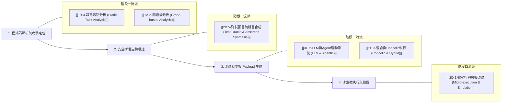

# 🛡️ SecVerify 兩大面向研究流派對照與準備指南

本指南旨在為 **SecVerify（動態安全驗證模組）** 在不同研究設定下的論文寫作、文獻回顧（Related Work）與技術選型提供結構化的研究流派對照地圖。

所有流派標籤均已對齊 Obsidian Vault 目錄 `[[00-研究流派圖主目錄]]`。

---

## 📌 兩大研究面向總覽

```mermaid
graph TD
    A[SecVerify 動態安全驗證] --> B[面向一：既有安全基準測試改寫與現代化]
    A --> C[面向二：基於原始碼直接生成安全單元測試]
    
    B -->|重點| 解決既有漏洞庫 API 棄用/過時問題 (如 Ghera 現代化)
    C -->|重點| 給定 Source Code 直接產出含 Security Oracle 的單元測試
```

---

## 🧭 面向一：既有安全基準測試改寫與現代化 (Benchmark Modernization & Adaptation)

### 1.1 適用場景與研究問題
* **情境**：已有舊版漏洞基準庫（如 Ghera Benchmark），但因 Android API 版本疊代、JUnit 框架更迭（如 JUnit 3 轉 JUnit 5 / Robolectric）導致測試無法運作。
* **目標**：利用 RAG、LLM 語義對齊與框架翻譯技術，將傳統漏洞測試案例改寫並現代化為可在 Headless JVM 中運行的安全測試腳本。

### 1.2 核心研究流派清單

| 階段 / 維度 | 對應研究流派標籤 | 計畫書關鍵技術 / 核心文獻 | 解決之核心問題 |
| :--- | :--- | :--- | :--- |
| **動態微執行** | `[[2D.1-微執行與模擬測試 (Micro-execution & Emulation)]]` | Robolectric, Headless JVM Sandboxing | 捨棄高成本 Android 模擬器/實機 |
| **執行期插樁** | `[[2C.1-執行期插樁與監控 (Instrumentation & Sanitizers)]]` | Mockito Spy, Intercepting Sinks (`Log.d`) | 動態捕捉 Sink 傳入參數與變數快照 |
| **補丁驗收** | `[[3A.2-安全補丁驗證與PCA (Validation & PCA)]]` | Post-Repair Security Validation | 作為修復（SecRepair）後的自動化動態驗收引擎 |
| **漏洞利用** | `[[2D.5-自動漏洞利用生成 (Automated Exploit Generation - AEG)]]` | Payload Construction, Evidence Bundle | 構造具攻擊性的測試 Payload 與證據包 |
| **基準庫挖掘** | `[[1D.5-漏洞情報與軟體歷史庫挖掘 (Vulnerability Intelligence & Repository Mining)]]` | Ghera Benchmark [10] | 分析並提取既有漏洞 Benchmark 的觸發邏輯 |
| **靜動態結合** | `[[1B.4-靜態污點分析 (Static Taint Analysis)]]` <br>`[[2B.2-動態污點分析 (Dynamic Taint Analysis - DTA)]]` | DFG Constraints, Source-to-Sink | 接收靜態污點路徑，約束動態測試範圍 |
| **測試共演進** | `[[2B.4-變異測試 (Mutation Testing)]]` | REACCEPT [26] (ISSTA 2025) | 透過測試覆蓋與斷言監控測試程式演進 |
| **測試修復** | `[[3A.1-故障定位 (Fault Localization)]]` | Fix the Tests [28] (ISSRE 2024) | 測試腳本報錯 (Build Fail) 時的二次自動修復 |
| **AI 測試遷移** | `[[3C.2-LLM與Agent驅動修復 (LLM & Agentic)]]` | Airbnb AI Test Migration [27], Google Migration [29] | 跨框架/跨 API 版本的語義對齊與測試翻譯 |

---

## 🎯 面向二：基於原始碼直接生成安全單元測試 (Direct Source Code-to-Security Test Generation)

### 2.1 適用場景與研究問題
* **情境**：開發者剛寫完一段 Kotlin/Java 函式（Source Code），系統需自動分析該程式碼並**直接生成包含 Payload 與安全斷言（Security Oracle）的 JUnit/Robolectric 單元測試**。
* **目標**：實現真正的「Code-to-Security-Test」自動化，擺脫對既有 Benchmark 的依賴。

### 2.2 核心 Pipeline 與 6 大關鍵流派



#### 階段詳解：

#### 🔹 階段一：程式碼解析與攻擊路徑定位（分析 Code 哪裡需要測？）
1. **`[[1B.4-靜態污點分析 (Static Taint Analysis)]]`**
   * **作用**：追蹤待測程式碼的 Source（外部輸入點）至 Sink（敏感操作點，如 `db.rawQuery`, `Log.d`）。
2. **`[[1A.2-圖結構分析 (Graph-based Analysis)]]`**
   * **作用**：利用 CPG (Code Property Graph) 結合 AST、CFG、DFG 提供關聯結構，縮小安全測試的觸發範圍。

#### 🔹 階段二：安全斷言自動構建（核心關鍵：如何生成 Security Oracle？）
3. **`[[2B.5-測試預言與斷言合成 (Test Oracle & Assertion Synthesis)]]`**
   * **作用**：利用 LLM / NMT 或安全規範，自動生成安全斷言（Security Oracle），將安全控制項（如 MASVS）與安全不變量 (Safety Invariants) 轉化為測試腳本內的 `assertTrue()` / `assertFalse()`。

#### 🔹 階段三：測試輸入與測試腳本生成（直出具攻擊性的 Test Code）
5. **`[[3C.2-LLM與Agent驅動修復 (LLM & Agentic)]]`**（分支：LLM Security Test Generation）
   * **作用**：利用 LLM / Prompt / RAG 將原始程式碼、污點路徑與安全不變量結合，直接生成可讀性高且包含 Payload 的完整單元測試檔案。
6. **`[[2B.3-混合與Concolic執行 (Concolic & Hybrid)]]`**（或 `[[1B.3-符號執行 (Symbolic Execution)]]`）
   * **作用**：求解路徑約束（Constraint Solving），輔助生成能夠精準突破特定 `if` 分支或邊界條件的極端 Payload 輸入。

#### 🔹 階段四：測試腳本的沙盒微執行與驗證（確保測試能跑通）
7. **`[[2D.1-微執行與模擬測試 (Micro-execution & Emulation)]]`**
   * **作用**：在 Robolectric Headless 沙盒中即時執行生成的測試，驗證測試腳本的可編譯性與斷言觸發有效性。

---

## 📊 兩大面向對照比較矩陣

| 比較維度 | 面向一：既有 Benchmark 改寫現代化 | 面向二：基於原始碼直接生成安全測試 |
| :--- | :--- | :--- |
| **輸入源 (Input)** | 舊版漏洞測試範本 (如 Ghera) + 最新 API 文件 | 待測原始碼 (Source Code) + 靜態污點分析 (DFG) |
| **核心挑戰 (Main Challenge)** | 跨 API/框架語義對齊、語法遷移與廢棄介面修復 | 自動建構安全斷言 (Security Oracle) 與路徑覆蓋 Payload |
| **最核心流派標籤** | `[[3C.2-LLM與Agent驅動修復 (LLM & Agentic)|3C.2]]` (AI Migration) + `[[1D.5-漏洞情報與軟體歷史庫挖掘 (Vulnerability Intelligence & Repository Mining)|1D.5]]` (Repo Mining) | `[[2B.5-測試預言與斷言合成 (Test Oracle & Assertion Synthesis)|2B.5]]` (Test Oracle) + `[[1B.4-靜態污點分析 (Static Taint Analysis)|1B.4]]` (Taint Analysis) |
| **共通底層架構** | `[[2D.1-微執行與模擬測試 (Micro-execution & Emulation)]]` (Robolectric JVM 沙盒執行) | `[[2D.1-微執行與模擬測試 (Micro-execution & Emulation)]]` (Robolectric JVM 沙盒執行) |

---

## 💡 總結與 Obsidian 筆記關聯建議

* 若您要撰寫 **「Android 漏洞庫現代化與測試遷移」** 相關章節，請優先閱讀與連結 **面向一** 的 9 大流派。
* 若您要研究 **「AI 導引之自動化安全單元測試生成 (Security TestGen)」**，請重點維護 **面向二** 的 6 大流派，特別是 **`[[2C.1-執行期插樁與監控 (Instrumentation & Sanitizers)]]`** 與 **`[[1B.4-靜態污點分析 (Static Taint Analysis)]]`**。
