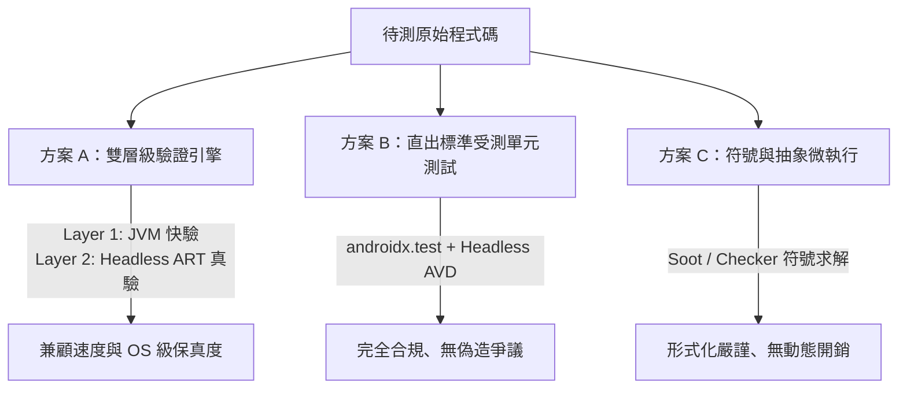

# 🚀 SecVerify 第二年重新設計：三大動態驗證方案評估指南

本文件記錄專案第二年（SecVerify）因應國科會（NSTC）計畫申請與學術評審審查，從「純 Robolectric 微執行」升級並重新設計的三大技術方案。

---

## 💡 重新設計之背景與檢討（Motivation & Critique）

原本的 SecVerify 1.0 規劃採用桌面 JVM 環境上的 **Robolectric 微執行** 作為主力動態驗證引擎，但在學術審查（如 ICSE / ISSTA / USENIX Security）與實際資安驗證中存在以下 2 大致命傷：

1. **環境保真度落差（Environmental Fidelity Gap）**：
   Robolectric 僅能在 Desktop JVM 執行 Shadow Objects（模擬物件），無法執行真正的 Linux Kernel、SELinux、Binder IPC、Android KeyStore 或 Native Code (`.so`)。真正的 Android 系統級漏洞（Intent 劫持、Component 洩漏、權限繞過）無法在純 JVM 中真實重現與驗證。
2. **Mock 的循環論證（Circular Logic / Mock Hallucination）**：
   若大量使用 Mockito 去 Mock/Spy 敏感 Sink（如 `Log.d` 或 `SharedPreferences`），實質上是在測試「Mock 物件有無按預期運作」，而非測試「Android OS 安全邊界」，易被質疑為偽造測試。

---

## 🎯 三大重新設計方案詳細評估

---

### 方案 A：雙層級驗證引擎 (Hybrid Verification Engine)【⭐ 最推薦】

* **核心理念**：兼顧「IDE 即時性」與「OS 級資安保真度」，將動態驗證分為兩層。
* **架構設計**：
  * **Layer 1（快驗層 - Desktop JVM / Robolectric）**：僅負責「純資料處理與演算法邏輯」（如輸入驗證 Sanitization、密碼學工具類別包裝、字串處理）。執行時間 < 1 秒。
  * **Layer 2（真驗層 - Headless ART / MicroDroid / Cuttlefish）**：採用現代化無 UI 輕量 Android 沙盒，專門驗證涉及 Android OS 安全邊界（Intent IPC, Component 權限, File Permission, 實體 Logcat 輸出）之行為。
* **對應研究流派**：
  * `[[2D.1-微執行與模擬測試 (Micro-execution & Emulation)]]` (Layer 1 快驗)
  * `[[2A.3-惡意程式沙盒與行為分析 (Malware Sandbox)]]` (Layer 2 輕量沙盒)
  * `[[2C.1-執行期插樁與監控 (Instrumentation & Sanitizers)]]` (動態參數快照)
  * `[[3A.2-安全補丁驗證與PCA (Validation & PCA)]]` (修復驗收引擎)
* **優缺點評估**：
  * ✅ **優點**：學術創新度與完整度最高，完美解決 Robolectric 保真度被質疑的問題。
  * ❌ **挑戰**：需要維護背景 Headless Android 輕量沙盒環境。

---

### 方案 B：直出 Android 官方標準受測單元測試 (Instrumented Security Tests)

* **核心理念**：不自己開發非標準的微執行器，而是讓系統利用 LLM 直接生成符合 Android 官方規範的 `AndroidTest`（使用 `androidx.test` + `ActivityScenario`）。
* **架構設計**：
  * 利用 LLM / Agent 解析 DFG 污點路徑後，直接產出標準 Instrumented Test 腳本，內含攻擊 Payload 與 Android 系統 API 的安全斷言。
  * 結合 IDE 背景的 Headless AVD 或 Gradle 測試任務自動執行。
* **對應研究流派**：
  * `[[2B.5-測試預言與斷言合成 (Test Oracle & Assertion Synthesis)]]` (安全斷言與 Oracle 生成)
  * `[[3C.2-LLM與Agent驅動修復 (LLM & Agentic)]]` (LLM 測試腳本生成)
  * `[[2C.1-執行期插樁與監控 (Instrumentation & Sanitizers)]]` (系統級插樁監控)
  * `[[2D.5-自動漏洞利用生成 (Automated Exploit Generation - AEG)]]` (Payload 與 PoC 生成)
* **優缺點評估**：
  * ✅ **優點**：完全合規、無偽造爭議；生成出的測試腳本可直接留給開發者永續維護（ DevSecOps 左移）。
  * ❌ **挑戰**：執行時間略長於純 JVM（約需 3-5 秒）。

---

### 方案 C：符號微執行與靜態抽象詮釋 (Abstract Micro-execution via Soot/Checker)

* **核心理念**：完全放棄動態執行與 Mock，走形式化驗證（Formal Verification）路線。
* **架構設計**：
  * 利用 Soot 或 Checker Framework，將待測 Function 抽出，在語意層級進行路徑符號求解（Symbolic Path Solving）。
  * 證明該 Function 在所有可能輸入下是否滿足安全不變量（Safety Invariants，如 Type-based IFC 或 Taint Invariants）。
* **對應研究流派**：
  * `[[1B.3-符號執行 (Symbolic Execution)]]`
  * `[[1B.2-抽象解釋 (Abstract Interpretation)]]`
  * `[[1D.3-形式化驗證與模型檢查 (Formal Verification & Model Checking)]]`
  * `[[1A.3-型別系統與資訊流分析 (Type System & IFC)]]`
* **優缺點評估**：
  * ✅ **優點**：數學嚴謹度極高，完全沒有環境不穩定的問題。
  * ❌ **挑戰**：對複雜的 Android 框架邏輯容易發生路徑爆炸（Path Explosion）或求解失敗。

---

## 📊 三大方案綜合評估對照表

| 評估維度 | 方案 A：雙層級驗證 (Hybrid) | 方案 B：直出標準受測測試 (Instrumented) | 方案 C：符號/抽象微執行 (Symbolic) |
| :--- | :--- | :--- | :--- |
| **環境保真度 (Fidelity)** | 🔥 高 (OS 級真驗) | 🔥 極高 (官方標準環境) | ➖ N/A (靜態形式化) |
| **IDE 執行速度** | ⚡ 快 (< 2 秒 / 分層分流) | 🐢 中等 (約 3-5 秒) | ⚡ 極快 (無動態開銷) |
| **學術創新度 (Novelty)** | 🌟🌟🌟🌟🌟 (分層機制) | 🌟🌟🌟🌟 (LLM Security TestGen) | 🌟🌟🌟 (形式化導向) |
| **避開 Mock 質疑** | 成功 (Layer 2 實測 OS) | 成功 (使用實體 System API) | 成功 (無須任何 Mock) |
| **國科會通過率預估** | 🟢 **極高** | 🟢 **高** | 🟡 **中等 (偏理論)** |

---

## 📝 計畫書撰寫建議

建議以 **方案 A（雙層級驗證引擎）** 作為第二年計畫主軸，並將 **方案 B** 作為生成的標的腳本規範。這樣在計畫書中既有「分層動態驗證」的架構創新，又能強調成果能輸出「標準化 Android 受測資安單元測試」，展現高度學術價值與產業實用性。
