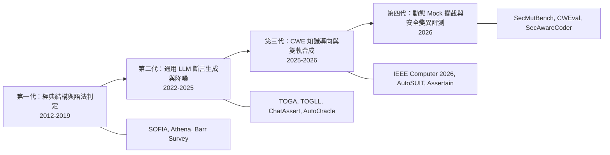

# 📚 自動生成安全斷言（Security Oracle Generation）五合一文獻綜述大滿貫

本文件將 5 次 AI 檢索結果（`oracle1.md` ~ `oracle5.md`）進行系統化整合、交叉比對與精華提煉，建構出一份涵蓋 **經典理論、LLM 斷言生成、CWE 導向合成、動態 Mock 攔截** 的完整文獻地圖。

---

## 🎯 綜述總覽與核心發現

AI 在 5 次檢索中呈現出不同維度的文獻光譜，共同描繪出安全斷言研究從 **「經典語法/結構判定」** 演進至 **「LLM 語意推導 + 動態 Mock 攔截」** 的發展軌跡：

---

## 📊 五合一全景文獻技術對照總表

| 論文 / 框架 | 發表場合與年份 | 核心技術手法 | 解決之 Oracle 難題 | 檔案來源 |
| :--- | :--- | :--- | :--- | :--- |
| **Barr et al. Survey** | IEEE TSE 2015 | Specified / Derived / Implicit Oracle 奠基分類法 | 系統化定義 Test Oracle Problem 理論基礎 | oracle1, oracle5 |
| **Avancini & Ceccato** | 2012 | Tree Kernel ML 分類器（比對 HTML 輸出 Parse Tree） | XSS 語意層級結構變異判定 | oracle2 |
| **SOFIA** | ASE 2016 / ISSTA 2016 | 黑箱 SQL Parse Tree 比對 + K-medoids 分群 | SQLi (CWE-89) 查詢結構竄改判定 | oracle1, oracle4, oracle5 |
| **Athena** | JSS 2019 | 靜態 Gate 分析 + 動態 AspectJ Logging | 從程式碼結構與意圖動態萃取 Security Policy | oracle1, oracle3 |
| **TOGA** | ICSE 2022 | Transformer 統一推斷 Exception 與 Assertion Oracle | 推斷「預期行為」而非僅比對當前實作行為 | oracle3 |
| **TOGLL / OracleGuru** | ICSE 2024 / ICSE 2025 | 微調 Code LLM + CCS (Check, Correct, Strong) 框架 | 解決 LLM 生成斷言強度薄弱與幻覺問題 | oracle1, oracle2, oracle3, oracle4 |
| **ChatAssert** | IEEE TSE 2025 | LLM Prompt + 靜態編譯修復 + 動態執行回饋閉環 | 消除錯誤斷言，提升 Acc@1 達 15% | oracle2, oracle3, oracle4, oracle5 |
| **AugmenTest** | 2025 | LLM 針對既有 Test Prefix 直接生成預期斷言 | 事先生成預期斷言優於事後審核 | oracle2 |
| **AutoOracle** | ICSE 2026 | C++ LLM Oracle + Suspicious Oracle Filtering (SOF) | 工業級（Samsung SSD 韌體）過濾降噪 52.3% | oracle1 |
| **IEEE Computer 2026** | IEEE Computer 2026.02 | LLM 不變量合成 + CWE/OWASP/CVE 轉化為 Probes | 無 Ground Truth 時由規範自動合成安全探針 | oracle1, oracle2, oracle3, oracle5 |
| **AutoSUIT Bench** | ACL Findings 2026 | 漏洞版本 vs 安全修補版本 雙軌對照生成 | 解決安全規範到可執行 Oracle 的轉譯 | oracle3 |
| **SecMutBench** | AIware 2026 | 25 種 CWE 變異運算子 + 11 種 CWE Mock 環境攔截 | 區分真正的「語意擊殺」與「偶發崩潰」 | oracle3, oracle4 |
| **CWEval** | ICSE 2025 / 2026 | Outcome-driven 評測框架 (31 種 CWE 雙重測試) | 動態執行評估功能正確性與安全合規性 | oracle1, oracle4, oracle5 |
| **Assertain** | arXiv 2026.04 | RTL 結構 + CWE 知識庫對映 + 自我反思精煉 | 自動生成 SystemVerilog 安全斷言 (SVA) | oracle5 |
| **SecAwareCoder** | ISSTA 2026 | 任務適應性威脅建模 (77 種 CWE 成對測試) | 跨 CWE 類別的自動化安全測試生成 | oracle5 |

---

## 🔍 四大技術範式深度剖析

### 1. 理論基礎與傳統結構化判定（Classic & Structural Oracles）
* **代表論文**：`Barr et al. (TSE 2015)`, `SOFIA (ASE 2016)`, `Athena (JSS 2019)`
* **核心機制**：
  * 傳統方法認識到 `assertEquals` 或 `assertNotCrash` 無法捕捉安全漏洞。
  * **SOFIA** 利用 SQL Parse Tree 的樹編輯距離（Tree Edit Distance），當攻擊輸入導致 SQL 結構發生超出門檻的變動時，即判定為 SQL 注入。
  * **Athena** 靜態定位系統 Entry/Exit Gate，透過 AspectJ 動態織入日誌，構建安全行為模型。
* **歷史意義**：為「不依賴人工寫 Assertion，而是比對執行期結構變異」奠定了理論基礎。

### 2. LLM 導引之通用 Assertion 生成與閉環修復（LLM-driven Oracle Synthesis）
* **代表論文**：`TOGLL (ICSE 2025)`, `ChatAssert (TSE 2025)`, `AutoOracle (ICSE 2026)`
* **核心機制**：
  * **TOGLL** 提出 Check, Correct, Strong (CCS) 三大指標，證明微調後的 LLM 能推斷程式「應該做什麼（預期行為）」而非「目前做了什麼」。
  * **ChatAssert** 提出經典的三階段黃金閉環：`LLM 初步生成 ➡️ 靜態分析修正編譯錯誤 ➡️ 動態執行結果回饋修正邏輯錯誤`。
  * **AutoOracle** 針對 LLM 大量產出「無效/垃圾斷言」的痛點，提出 **Suspicious Oracle Filtering (SOF)** 演算法，在 Samsung 工業專案中成功降噪 52.3%。

### 3. CWE/OWASP 導向之安全 Oracle 自動合成（CWE/OWASP-driven Synthesis）
* **代表論文**：`IEEE Computer (2026.02)`, `AutoSUIT Bench (ACL 2026)`, `Assertain (2026.04)`
* **核心機制**：
  * **IEEE Computer 2026** 系統性論證 LLM 能吸收 CWE、OWASP Top 10 與 CVE 知識庫，將自然語言規範「翻譯」為可執行的安全探測（Executable Probes）。
  * **AutoSUIT Bench** 採用**雙軌對照法**：要求 LLM 同時生成漏洞版程式與修復版程式，以兩者在相同輸入下的行為差異邊界自動導出 Security Oracle。
  * **Assertain** 結合「設計結構分析 + CWE 知識庫映射 + 反思去重」，將提示詞分為角色、CWE 定義與原始碼三層。

### 4. 動態 Mock 攔截與安全變異評測（Dynamic Mock Interception & Security Mutation）
* **代表論文**：`SecMutBench (AIware 2026)`, `CWEval (ICSE 2026)`
* **核心機制**：
  * **SecMutBench** 解決了評測 LLM 安全斷言能力的關鍵漏洞：傳統 Mutation Score 會將「程式意外崩潰 (Incidental Crash)」誤判為「成功偵測安全漏洞」。
  * 提出 **11 種 CWE 專屬 Mock 環境**（透過 Python `sys.modules` 與 `builtins` 攔截 Sink 呼叫，如 `db.last_params`），並定義 **Security Mutation Score (SMS)**，專門衡量「語意層擊殺（Semantic Kill）」。

---

## 💎 對 SecVerify 計畫的 3 大關鍵學術洞察與 Research Gap

綜合這 5 份檢索報告，我們可以為您的 **SecVerify 計畫** 提煉出 3 個極具價值的學術突破口：

### 洞察 1：語意擊殺 (Semantic Kill) 必須依賴 Sink 攔截
`SecMutBench (2026)` 證實：靜態工具（如 Bandit）對語法可辨識 CWE（SQLi, 硬編碼）有用，但對 19 種「邏輯缺陷型 CWE」（如未授權存取、敏感 Log 洩漏）偵測率為 **0%**。
👉 **SecVerify 的價值**：您規劃利用 **Mockito Spy 攔截 Sinks（`Log.d`, `SharedPreferences`）**，恰好填補了這個空白！

### 洞察 2：黃金閉環架構 (ChatAssert 模式)
`ChatAssert (TSE 2025)` 與 `AutoOracle (ICSE 2026)` 證明單純 Prompt LLM 一次性生成斷言準確率低。
👉 **SecVerify 的價值**：SecVerify 規劃的 `LLM 生成 ➡️ Javac 編譯檢驗 ➡️ Robolectric / 沙盒動態執行 ➡️ 錯誤回饋修正`，完全符合當前最前沿的 SOTA 閉環範式！

### 洞察 3：Android / Mobile 領域的巨大 Research Gap（研究缺口）🔥
這 5 份報告搜尋到的最新 2026 論文（SecMutBench, AutoOracle, Assertain）涵蓋了 C/C++ 韌體、Python Web、RTL 硬體與 SQLi，**但完全沒有一篇專門處理 Android 行動端（Logcat 洩漏、SharedPreferences 明文、Intent IPC 劫持）的專屬 Mock 斷言生成與沙盒驗收！**
👉 **SecVerify 的價值**：在計畫書中強調 **「將 SOTA 的 Security Oracle Generation 與 Dynamic Mock Interception 首次擴展至 Android 行動安全生態」**，評審將無法抗拒其學術新穎性！
